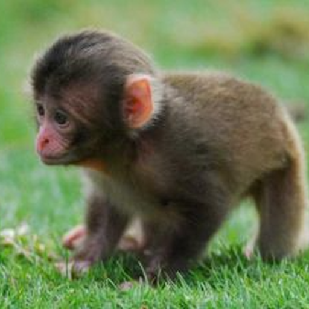

    
  </a>

<h1 align="center">MonkeeMusic</h1>
<h3 align="center">Command Prefix: [</h3>

An open source, feature rich, and monkey themed Discord music bot!

Invite him to your server today: https://discord.com/api/oauth2/authorize?client_id=786887384620859392&permissions=8&scope=bot 

 
 

# Commands

| Command | Usage | Description |
| ------- | ---------- | ----------- |
| bitrate | \[bitrate [value (kps)] | Sets the bots bitrate. Will not go into effect until the next song. |
| clean | \[clean [number of messages] | clear messages from the text channel. |
| clear | \[clear | clear all songs from the current queue. |
| clear | \[clear | clear all songs from the current queue. |
| duration | \[duration, #duratin queue, #duration [playlist name] | displays either the duration of the song playing, the current queue, or a specified playlist. |
| loop | \[loop [number of loops (infinite if not specified)] | loop the song that is currently playing. |
| move | \[move [current position] [desired position] | move a song to a different position in the queue. |
| playing | \[playing | display the song that is currently playing. |
| play | \[play [link or query (song name)] | play a specified song in the bot. |
| playtop | \[playtop [link or query (song name)] | add a song to the upcoming position in the queue. |
| play (playlists) | \[play [playlist] [playlist name] | play one of the custom playlists through the bot. |
| pause | \[pause | pause the song that is currently playing. |
| removedupes | \[removedupes | remove all duplicate songs from the queue. |
| resume | \[resume | resume the song that is currently playing. |
| queue | \[queue | view all of the songs in the current queue. |
| shuffle | \[shuffle | shuffles all of the songs in the current queue. |
| save | \[save [name for playlist] | save the current queue as a playlist. |
| settings | \[settings | show the server specific config of the bot. |
| skip | \[skip | skip the song that is currently playing in the queue. |
| stop | \[stop | stop the audio stream and clear the queue. |
| reverse | \[reverse | reverses the order of the current song queue. |
| volume | \[volume [value between 0 and 10] | adjust the channel wide volume of the bot. |

# Playlist Commands

| Command | Usage | Description |
| ------- | ---------- | ----------- |
| playlists create | \[playlists create [playlist name] | create a new playlist for the server. (max 25) |
| playlists delete | \[playlists delete [playlist name] | delete a playlist from the server. |
| playlists add | \[playlists add [playlist name] [link or query (song name)] | add a song to a specified playlist. |
| playlists remove | \[playlists remove [playlist name] [song position] | remove a song at a specific position from a specified playlist. |
| playlists show | \[playlists show [playlist name] | show all of the songs in a specified playlist. |
| playlists all | \[playlists all | show all of the playlists on the server. |
